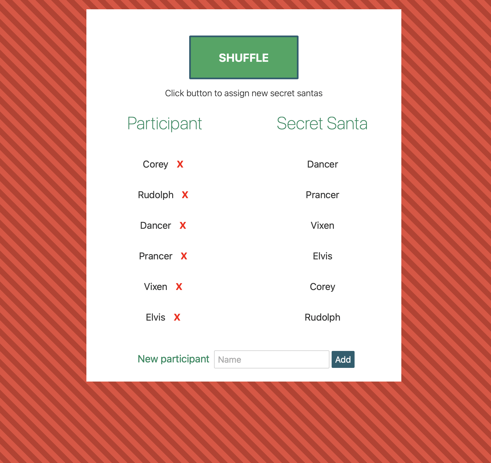

#It's Christmas Time!
##Quick, dig up that link to assign the secret santas while you're still thinking about it!



## Development
Install the dependencies...

```bash
cd svelte-app
npm install
```

...then start [Rollup](https://rollupjs.org):

```bash
npm run dev
```

Navigate to [localhost:5000](http://localhost:5000). You should see your app running. Edit a component file in `src`, save it, and reload the page to see your changes.

By default, the server will only respond to requests from localhost. To allow connections from other computers, edit the `sirv` commands in package.json to include the option `--host 0.0.0.0`.


## Building and running in production mode

To create an optimised version of the app:

```bash
npm run build
```
